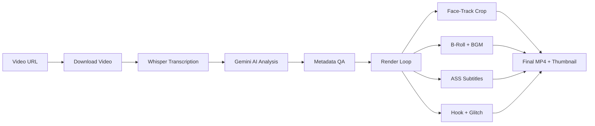

# 🎬 OpenSource Clipping

**Ultimate AI Auto-Clipper & Teaser Generator** — an open-source content factory that transforms long-form videos into cinematic short-form highlights with hook teasers, karaoke subtitles, and auto-thumbnails.

> 🇮🇩 [Baca dalam Bahasa Indonesia](README_ID.md)

---

## ✨ Features

| Feature | Description |
|---|---|
| **AI Transcriber** | Word-level transcription using **Faster-Whisper** (large-v3) |
| **AI Content Curator** | **Google Gemini** analyzes context, picks the most viral moments, and generates metadata |
| **Smart Auto-Framing** | Face-tracking via **[MediaPipe BlazeFace (Full-Range)](https://ai.google.dev/edge/mediapipe/solutions/vision/face_detector)** with Smooth Pan, Deadzone & anti-jitter algorithms |
| **Cinematic Teaser Hook** | 3-second hook with dark overlay, cinematic bars, and **TV Glitch** transition |
| **Karaoke Subtitles** | Word-by-word highlighted `.ASS` subtitles (Alex Hormozi / Veed style) |
| **Kinetic Typography** | AI-driven word emphasis with bounce/stagger animations & dual-font system |
| **B-Roll Integration** | Auto-fetches contextual stock footage from **Pexels** with crossfade & Ken Burns |
| **Multi-Hook Intro (V2)** | Creates high-retention 3-4 micro-hook intros with flash/glitch transitions |
| **Smart Segment Trimming** | AI dynamically selects the best segments to cut out boring/silent parts |
| **Auto-BGM & Ducking** | Local BGM asset pool (`assets/bgm/`) with 2 modes: *sidechain ducking* (BGM auto-lowers during speech) or *background* (constant low volume). MP3 files auto-loop if shorter than the video |
| **Auto-Thumbnail** | Frame extraction with dark overlay and large title text |
| **Cross-Platform Metadata** | YouTube title/description/tags + TikTok caption — all in English |
| **Auto YouTube Uploader** | Automatically upload highlight clips to YouTube with scheduling support and full metadata (optional) |
| **Podcast Split-Screen** | Auto speaker diarization via **Pyannote** with top-bottom split-screen layout for podcasts (9:16). Supports **3+ speakers across multiple scenes** with per-speaker frozen frame fallback |
| **Podcast Camera Switch** | Auto active-speaker detection with scene-aware switching — full 9:16 crop focuses on whoever is talking; blurred pillarbox only when speakers in the same scene talk simultaneously (9:16) |
| **AI Voice-Over** | Converts auto-clips into original commentary/reaction videos using **Gemini** (script generation) and **edge-tts** (free text-to-speech), complete with audio ducking and text override |

> 🎬 **NEW: Story Clip Mode (`--story-mode`)**  
> Need to assemble a narrative from multiple specific video sources (like a brand campaign)? We've just introduced the Multi-Source Story Clip Mode!  
> 👉 **[Read the full Story Clip Documentation](docs/STORY_CLIP.md)**

## 📋 Prerequisites

- **Python** 3.10+
- **FFmpeg** installed and available in PATH
- **CUDA GPU** recommended (for Whisper; CPU fallback available)
- **Google Gemini API Key** ([get one here](https://aistudio.google.com/apikey))
- **Pexels API Key** (optional, for B-roll — [get one here](https://www.pexels.com/api/))
- **HuggingFace Token** (optional, for split-screen / camera-switch — [get one here](https://huggingface.co/settings/tokens), requires accepting [Pyannote model agreement](https://huggingface.co/pyannote/speaker-diarization-3.1))

## ☁️ Running on Google Colab (Recommended)

If you don't have a local GPU, the easiest way to run this pipeline is via **Google Colab**.
Open a new Google Colab notebook, set the Runtime to **T4 GPU**, and create the following cells:

**Cell 1: Setup & Clone**
```python
!rm -rf ./* ./.*
!git clone https://github.com/your-username/opensource-clipping.git .
!pip install -r requirements.txt
```

**Cell 2: Setup API Keys**
```python
import os
from pathlib import Path
from google.colab import userdata

# Store your keys in Colab Secrets first!
GOOGLE_API_KEY = userdata.get("GOOGLE_API_KEY")

env_text = f"GOOGLE_API_KEY={GOOGLE_API_KEY}\n"
Path(".env").write_text(env_text, encoding="utf-8")
```

**Cell 3: Execute (Example including Kaggle fallback for float32)**
```python
URL_YOUTUBE = "https://www.youtube.com/watch?v=Dc4_aBFAYWE&pp=0gcJCdkKAYcqIYzv"
JUMLAH_CLIP = 10
RASIO = "9:16"
FONT_STYLE = "DEFAULT"
GEMINI_MODEL = "gemini-3-flash-preview"
# Use 'float32' for Kaggle CPU/T4 limitations, or 'float16' for standard Colab T4 GPUs
WHISPER_COMPUTE_TYPE = "float32"

!python main.py \
  --url "{URL_YOUTUBE}" \
  --clips {JUMLAH_CLIP} \
  --ratio "{RASIO}" \
  --font-style "{FONT_STYLE}" \
  --hook-duration 3 \
  --words-per-sub 5 \
  --gemini-model "{GEMINI_MODEL}" \
  --whisper-compute-type "{WHISPER_COMPUTE_TYPE}" \
  --no-bgm
```

*(Note: We have also included `notebooks/Lib_OpenSource_Clipping.ipynb` in the repo as a ready-to-use template).*

---

## 🚀 Local Quick Start

```bash
# 1. Clone the repo
git clone https://github.com/your-username/opensource-clipping.git
cd opensource-clipping

# 2. Install dependencies (pick one)
pip install -r requirements.txt          # pip / Colab
# uv sync                               # or use uv (reads pyproject.toml)

# 3. Set up API keys
cp .env.sample .env
# Edit .env and add your GOOGLE_API_KEY

# 4. Run (Must include --url)
python main.py --url "https://youtube.com/watch?v=VIDEO_ID"
# 5. Examples of Execution

# Standard run (Default options with 5 clips)
python main.py --url "https://youtube.com/watch?v=VIDEO_ID" --clips 5 --ratio 16:9

# Prefer highest available source quality (default behavior)
python main.py --url "https://youtube.com/watch?v=VIDEO_ID" --source-height max

# Cap source download to 1440p (2K)
python main.py --url "https://youtube.com/watch?v=VIDEO_ID" --source-height 1440

# Sharper output tuning (works for normal and dynamic-split modes)
python main.py --url "https://youtube.com/watch?v=VIDEO_ID" \
  --source-height 2160 \
  --video-cq 19 \
  --video-crf 17 \
  --video-preset slow \
  --video-scale-algo lanczos

# Advanced run (Using YOLOv8 GPU Face Tracking & Custom Fonts)
python main.py --url "https://youtube.com/watch?v=VIDEO_ID" \
  --clips 7 \
  --face-detector yolo \
  --yolo-size 8m \
  --font-style STORYTELLER

# Podcast Split-Screen (2 speakers, 9:16)
python main.py --url "https://youtube.com/watch?v=PODCAST_ID" \
  --clips 3 \
  --ratio "9:16" \
  --split-screen

# Podcast Camera Switch (auto-switches to active speaker, blurred pillarbox on overlap)
python main.py --url "https://youtube.com/watch?v=PODCAST_ID" \
  --clips 3 \
  --ratio "9:16" \
  --camera-switch \
  --switch-hold-duration 2.0

# Multi-Speaker Podcast (3 speakers across 2 scenes)
python main.py --url "https://youtube.com/watch?v=PODCAST_ID" \
  --clips 3 \
  --ratio "9:16" \
  --camera-switch \
  --diarization-speakers 3

# Manual Custom Hook (using external .mp4 clip)
python main.py --url "VIDEO_URL" --hook-source "DRIVE_URL_OR_PATH" --hook-source-start 5.0 --hook-duration 4

# Ultra-HD 2K Rendering (Fetch 1440p and render at native 1440p vertical resolution with sharpening)
python main.py --url "VIDEO_URL" --source-height 1440 --render-height source --video-sharpen

# Use NVIDIA NIM (DeepSeek-V3) instead of Gemini
python main.py --url "VIDEO_URL" --ai-provider nvidia --nvidia-model "deepseek-ai/deepseek-v4-pro"

# Square output for Instagram Feed (1:1)
python main.py --url "VIDEO_URL" --ratio "1:1" --clips 5

# Instagram/Facebook portrait (4:5)
python main.py --url "VIDEO_URL" --ratio "4:5" --clips 5

# Classic portrait (3:4)
python main.py --url "VIDEO_URL" --ratio "3:4" --clips 5

# TikTok source
python main.py --url "https://www.tiktok.com/@username/video/1234567890" --source tiktok --clips 3

# Instagram source
python main.py --url "https://www.instagram.com/reel/123456789/" --source instagram --clips 3

# Google Drive source
python main.py --url "https://drive.google.com/file/d/1234567890/view" --source gdrive --clips 3
```

## ⚙️ CLI Options

```
python main.py --help
```

| Argument | Default | Description |
|---|---|---|
| `--url`, `-u` | — | Video URL to process (Required) |
| `--source` | `youtube` | Video source platform. Choices: `youtube`, `tiktok`, `instagram`, `gdrive`. |
| `--clips`, `-n` | `7` | Number of highlight clips to generate |
| `--ratio`, `-r` | `9:16` | Output aspect ratio (`9:16`, `16:9`, `1:1`, `3:4`, `4:5`) |
| `--source-height` | `max` | Preferred source download max height (`max`, `1080`, `1440`, `2160`, etc.) |
| `--ai-provider` | `gemini` | AI provider for analysis (`gemini` or `nvidia`). |
| `--nvidia-model` | `deepseek...` | Model name for NVIDIA NIM API (e.g. `deepseek-ai/deepseek-v3`). |
| `--render-height` | `1080` | Target render output height (`1080`, `1440`, `2160`, `source`) |
| `--video-bitrate` | `auto` | Target video bitrate (e.g. 8M, 12M, auto). 'auto' scales based on resolution. |
| `--video-sharpen` | — | Apply a subtle sharpening filter for clearer output. |
| `--video-cq` | `23` | NVENC CQ quality target (lower is sharper). [Range: 15-20 (Ultra Sharp), 21-25 (Standard), 26-50 (Blurry)] |
| `--video-crf` | `20` | libx264 CRF quality target (lower is sharper). [Range: 15-20 (Ultra Sharp), 21-25 (Standard), 26-50 (Blurry)] |
| `--video-preset` | `auto` | Encoder preset override (NVENC: `p1`-`p7`, x264: `ultrafast`-`veryslow`). Use `auto` for default. |
| `--video-scale-algo` | `lanczos` | Resize algorithm for render (`lanczos`: sharp, `bicubic`: balanced, `area`/`bilinear`: fast/blurry) |
| `--words-per-sub` | `5` | Max words per karaoke subtitle group |
| `--hook-duration` | `3` | Hook teaser duration (seconds) |
| `--font-style` | `HORMOZI` | Font preset (`DEFAULT`, `STORYTELLER`, `HORMOZI`, `CINEMATIC`) |
| `--no-broll` | — | Disable B-roll footage |
| `--no-hook` | — | Disable hook glitch teaser |
| `--hook-source` | `None` | Google Drive URL or local path for a single custom hook video (.mp4) |
| `--hook-source-start` | `0.0` | Start time in seconds for the custom hook video |
| `--no-bgm` | — | Disable background music |
| `--bgm-mode` | `ducking` | BGM mixing mode: `ducking` (sidechain compress — BGM auto-lowers during speech) or `background` (constant low volume mix) |
| `--no-subs` | — | Disable all subtitle rendering |
| `--no-karaoke` | — | Use clean text instead of karaoke highlight |
| `--advanced-text` | `False` | Enable kinetic typography (word scaling & animation) |
| `--advanced-text-hook` | `False` | Enable kinetic typography specifically on the hook teaser |
| `--use-dlp-subs` | — | Use YouTube's built-in subtitles to speed up process (skips Whisper if found) |
| `--face-detector` | `mediapipe` | AI model for face tracking (`mediapipe` or `yolo`) |
| `--box-face-detection` | `False` | Draw yellow bounding boxes for tracking debug |
| `--dev-mode` | `False` | **[Experimental]** Enable 16:9 context visualization for 9:16 tracking/stabilization process |
| `--dev-mode-with-output` | `False` | **[Experimental]** Generates both the final production video and the dev dashboard video simultaneously. |
| `--dev-mode-with-output-merge` | `False` | **[Experimental]** Generates a merged ultrawide side-by-side video of the final output and the dev dashboard with boxed framing (v0.9.3). |
| `--track-lines` | `False` | Draw crosshair tracking lines extending from the face box to the boundaries |
| `--static-crop` | `False` | Disable face tracking and use static center crop for `1:1`, `3:4`, and `4:5` formats |
| `--yolo-size` | `8m` | YOLO face track model (`8n`, `8s`, `8m`, `8n_v2`, `9c`) |
| `--whisper-model` | `large-v3` | Whisper model size ([see here](https://github.com/SYSTRAN/faster-whisper?tab=readme-ov-file#whisper) for options) |
| `--whisper-device` | `cuda` | Whisper device (`cuda`, `cpu`, `auto`) |
| `--whisper-compute-type` | `float16` | Compute type for Whisper (`float32`, `float16`, `int8`, etc.) |
| `--gemini-model` | `gemini-3-flash-preview` | Gemini model name |
| `--gemini-fallback-model` | `gemini-2.5-flash` | Gemini fallback model name if main model fails |
| `--load-gemini-json` | `False` | Load the saved `gemini_response.json` from the output directory to bypass the Gemini API call |
| `--split-screen` | `False` | Enable split-screen mode for podcasts (9:16 only, requires `HF_TOKEN`). Supports 3+ speakers across multiple scenes |
| `--dynamic-split` | `False` | Automatically switch between full-screen and split-screen based on activity (requires `--split-screen`) |
| `--split-trigger` | `diarization` | Trigger for splitting: `diarization` (audio-based) or `face` (visual count) |
| `--diarization-speakers` | `auto` | Number of speakers for diarization (set to `3` for exact 3 speakers, or `auto` for visual AI auto-detection) |
| `--camera-switch` | `False` | Enable camera-switch mode for podcasts — full 9:16 crop switches to the active speaker; blurred pillarbox on simultaneous speech (9:16 only, requires `HF_TOKEN`) |
| `--switch-hold-duration` | `2.0` | Min seconds to hold on current speaker before switching (camera-switch only) |
| `--split-zoom` | `1.0` | Manual zoom factor for split-screen panels (e.g. 1.2, 1.5) |
| `--split-v-align` | `0.5` | Vertical alignment for split-screen panels (0.0=top, 0.5=center, 1.0=bottom) |
| `--split-auto-zoom` | `False` | **[New]** Automatically zoom into each panel to separate speakers for a clean frameless look |
| `--split-max-zoom` | `2.5` | Maximum zoom limit allowed for auto-zoom (default: 2.5) |
| `--track-step` | `None` | Face detection frequency in seconds (default: `0.25`) |
| `--track-deadzone` | `None` | Camera deadzone ratio where subject stays centered (default: `0.15`) |
| `--track-smooth` | `None` | Camera catch-up speed factor (default: `0.30`) |
| `--track-jitter` | `None` | Pixel threshold to ignore micro-shakes (default: `5`) |
| `--track-snap` | `None` | Jump threshold to trigger hard cut between speakers (default: `0.25`) |
| `--track-conf` | `0.55` | **[Experimental]** Face detection confidence threshold (raise to prevent ghosts) |
| `--track-smooth-window` | `12` | **[Experimental]** Frame window for layout stability (12 frames ≈ 0.5s) |
| `--scene-cut-threshold` | `18` | **[Experimental]** Sensitivity for camera-cut detection (instantly resets history) |
| `--track-iou-threshold` | `0.2` | **[Experimental]** Overlap threshold for merging duplicate detections |

## 📐 Aspect Ratios

OpenSource Clipping supports **5 output aspect ratios**. All vertical/square ratios include **face-tracking** by default to keep the subject centered.

| Ratio | Output | Face Tracking | Best For |
|---|---|---|---|
| `9:16` | 1080×1920 | ✅ Yes | TikTok, Reels, YouTube Shorts |
| `16:9` | 1920×1080 | ❌ No (letterbox if source differs) | YouTube, Landscape content |
| `1:1` | 1080×1080 | ✅ Yes (can disable via `--static-crop`) | Instagram Feed, Twitter/X |
| `3:4` | 1080×1440 | ✅ Yes (can disable via `--static-crop`) | Instagram Portrait, Pinterest |
| `4:5` | 1080×1350 | ✅ Yes (can disable via `--static-crop`) | Instagram/Facebook Feed |

> [!NOTE]
> When using `16:9` output with a non-16:9 source (e.g., vertical video), the system applies **letterboxing** (black bars) to preserve the original proportions instead of stretching.

## 🎙️ Podcast Modes

When processing podcast videos, you can choose between several intelligent rendering modes. These modes support **3+ speakers across multiple scenes**.

### 1. **`--split-screen` (Split Layout)**
Divides the screen into panels to show multiple speakers simultaneously.
*   **Default:** Permanent **Top-Bottom** layout (supports 3+ speakers via panel-swapping).
*   **`--dynamic-split`:** Automatically switches between **Full 9:16** (when 1 person is talking/visible) and **Split** (when 2+ are active).
*   **Trigger Modes (`--split-trigger`):**
    *   **`diarization` (Default):** Uses audio to know who is talking. Requires `HF_TOKEN`. Dimming effect on inactive speaker.
    *   **`face`:** Uses visual face count. **No token required**. No dimming effect.
*   **Optimization Features:**
    *   **Smart Separation Zoom (`--split-auto-zoom`):** Dynamically adjusts the zoom level of each panel to keep the framing tight on the speaker while excluding other detected faces. Ensures no "overlap" even when subjects are sitting close together.
    *   **Vertical Tracking:** Automatically follows face height, keeping the subject centered vertically (adjustable via `--split-v-align`).
*   **Best for:** Educational podcasts or when reaction shots are important.

### 2. **`--camera-switch` (Cinematic Switching)**
Mimics professional editing by focusing only on the active speaker in full screen.
*   **View:** **Full 9:16** that cuts between speakers.
*   **Scene-Aware:** Automatically uses **Blurred Pillarbox** if two people in the same wide-shot are talking; otherwise stays in clean full-crop.
*   **Best for:** Storytelling, interviews, or high-energy clips.

---

### **Comparison Table**

| Feature | `--split-screen` | `--camera-switch` |
| :--- | :--- | :--- |
| **Visual Layout** | Split (Top-Bottom) | Full Screen (Switching) |
| **Dynamic Mode** | ✅ `--dynamic-split` (Auto-toggle) | ✅ Always Dynamic |
| **Trigger Source** | Audio or Visual (`--split-trigger`) | Audio Only (Diarization) |
| **Reaction Shots** | ✅ Both speakers visible | ❌ Only 1 speaker visible |
| **Requirement** | Optional `HF_TOKEN` (Visual mode needs no token) | `HF_TOKEN` (Required) |

> [!TIP]
> Use `--split-screen --dynamic-split --split-trigger face` for the fastest rendering without needing any special API tokens or Diarization models.

---

## 🚀 Quick Start Examples

```bash
# 1. Standard AI Clipping (7 clips, 9:16)
python main.py --url "VIDEO_URL"

# 2. Dynamic Split-Screen (Visual-based, NO TOKEN REQUIRED)
python main.py --url "VIDEO_URL" --split-screen --dynamic-split --split-trigger face

# 3. Dynamic Split-Screen (Audio-based, Highlight active speaker, needs HF_TOKEN)
python main.py --url "VIDEO_URL" --split-screen --dynamic-split --split-trigger diarization

# 4. Cinematic Camera Switch (Needs HF_TOKEN)
python main.py --url "VIDEO_URL" --camera-switch

# 5. Smart Separation Split-Screen (Auto-Zoom & Vertical Track)
python main.py --url "VIDEO_URL" --split-screen --dynamic-split --split-trigger face --split-auto-zoom --split-v-align 0.4

# 6. Square output (1:1) with Split-Screen
python main.py --url "VIDEO_URL" --ratio "1:1" --split-screen --dynamic-split --split-trigger face

# 7. Hook V2 + Segment Trimming (default)
python main.py --url "VIDEO_URL" --hook-v2

# 8. Hook V2 + Aggressive Silence Trimming
python main.py --url "VIDEO_URL" --hook-v2 --silence-trim

# 9. Hook V2 without Segment Trimming (full render)
python main.py --url "VIDEO_URL" --hook-v2 --no-segment-trim

# 10. Hook V2 Custom: 4 micro-hooks with glitch style
python main.py --url "VIDEO_URL" --hook-v2 --hook-v2-items 4 --hook-v2-style "glitch_fast"
```

> [!IMPORTANT]
> Audio-based features (diarization) require a **HuggingFace Token** (`HF_TOKEN`) in your `.env` file and acceptance of the Pyannote model agreement on HuggingFace.

## 🗣️ AI Voice-Over Commentary

Prevent YouTube copyright/reused content strikes by turning raw clips into **original commentary/reaction videos** automatically.

When you pass the `--voiceover` flag, the pipeline will:
1. Generate a sharp, opinionated 3-5 sentence analysis script using **Gemini AI** based on the clip's specific transcript.
2. Synthesize the script into natural-sounding speech using **edge-tts** (free, no GPU required).
3. **Duck** the original video's audio down to 15% volume and overlay the AI voice-over at 100% volume.
4. **Override** the burned-in karaoke subtitles so they display the AI narrator's words instead of the original video transcript.

**Example Usage:**
```bash
# Basic voice-over (Uses default en-US-AvaNeural and English language)
python main.py --url "VIDEO_URL" --voiceover

# Voice-over in Indonesian with reaction style
python main.py --url "VIDEO_URL" --voiceover --voiceover-lang id --voiceover-voice id-ID-ArdiNeural --voiceover-style reaction
```

**Config Options:**
- `--voiceover-voice`: Choose the TTS voice (e.g. `en-US-AvaNeural`, `id-ID-GadisNeural`).
- `--voiceover-lang`: Script language (`en` or `id`).
- `--voiceover-style`: `analysis` (default), `reaction`, `lesson`, or `summary`.
- `--voiceover-volume`: Volume of narrator (default 1.0).
- `--original-volume`: Volume of ducked video audio (default 0.15).

## 🎵 BGM (Background Music) Settings

- `--no-bgm` : Disable the BGM feature entirely.
- `--bgm-mode ducking` *(default)* : **Sidechain Ducking** mode — BGM volume automatically lowers when the speaker is talking, then rises during pauses. Provides a professional effect like premium podcasts/YouTube videos.
- `--bgm-mode background` : **Constant Background** mode — BGM plays at a stable, low volume throughout the video without dynamic adjustments. Best for content with few pauses.

> 📁 **BGM Setup:**
> Place your royalty-free `.mp3` files into the `assets/bgm/<mood>/` folder (e.g., `assets/bgm/chill/`, `assets/bgm/epic/`, `assets/bgm/sad/`, `assets/bgm/upbeat/`, `assets/bgm/suspense/`). The script will **randomly** select a song from the mood folder requested by the AI. If the folder is empty, BGM will be skipped automatically.
>
> BGM files shorter than the video will be **auto-looped** (`-stream_loop -1`).
>
> See `assets/bgm/README.md` for recommended sources to download free BGM.

## 🎬 Understanding Hook V2 & Segment Trimming

### Final Video Structure

```
[Hook V2 Intro] → [MAIN CLIP] → done
   ↑                    ↑
   Rapid micro-hooks    This part is affected by Segment Trimming
   (0.5-2s × 3-4)
```

**Hook V2** and **Segment Trimming** are two independent features that operate on different parts of the video.

### Hook V2 (Multi-Hook Intro)

Hook V2 creates a **rapid-fire intro** at the beginning of the video — 3-4 short clips (0.5-2 seconds) taken from the most punchy/controversial moments within the clip. Each piece is separated by a white flash or glitch transition. The goal: **stop the viewer from scrolling** within the first 3-5 seconds.

```
Example Hook V2:
  [Clip 1: "NOBODY DARES" (1s)] → ⚡flash → [Clip 2: "THEY'RE ALL WRONG" (0.8s)] → ⚡flash → [Clip 3: "HERE'S THE TRUTH" (1.2s)] → [MAIN CLIP]
```

### Segment Trimming

Segment Trimming only applies to the **main clip** (after the hook). AI analyzes the main clip and **removes** boring sections — they're not sped up, they're **cut out entirely**, and the good parts are stitched together seamlessly.

```
Example:
  Main clip: second 30 - 90 (60 seconds total)
  
  AI finds:
    ✅ Second 30-55 : strong content, engaging
    ❌ Second 55-58 : speaker pauses/filler (removed)
    ✅ Second 58-90 : strong punchline

  Result: segment 1 + segment 2 joined directly
  Final duration: 57 seconds (3 seconds of filler removed)
```

### Flag Comparison

| Flag | Behavior | Affected Part |
|---|---|---|
| *(default, no flag)* | AI smart-trims boring/filler sections | Main clip only |
| `--silence-trim` | AI trims more aggressively — pauses >0.5s removed | Main clip only |
| `--no-segment-trim` | No trimming, full start-to-end render | Main clip only |

> [!NOTE]
> - **Hook V2 is not affected** by any of the above flags. Hook V2 always picks its rapid-fire clips as chosen by AI.
> - **`--no-hook` only disables Hook V1** (the 3-second glitch teaser). Hook V2 (`--hook-v2`) works independently even when `--no-hook` is active.
> - Segment Trimming and Silence Trimming **work without Hook V2** — just omit the `--hook-v2` flag.
> - If AI determines the entire clip is already tight and engaging, `keep_segments` will contain a single segment spanning the full duration (same effect as `--no-segment-trim`).

---

## 🐍 Recommended Configurations (Notebook/Colab)

These are verified configurations for optimal results in different scenarios.

### 1. Standard Mode (Standard Clipping)
Best for general videos where you want the best accuracy and focus.
```python
# Constants for Standard Clipping
URL_YOUTUBE = "https://www.youtube.com/watch?v=UXhdIF8kvCI"
JUMLAH_CLIP = 7
RASIO = "9:16"
FONT_STYLE = "DEFAULT"
GEMINI_MODEL = "gemini-2.0-flash"

!python main.py \
  --url "{URL_YOUTUBE}" \
  --clips {JUMLAH_CLIP} \
  --ratio "{RASIO}" \
  --font-style "{FONT_STYLE}" \
  --hook-duration 3 \
  --words-per-sub 5 \
  --face-detector yolo \
  --gemini-model "{GEMINI_MODEL}" \
  --no-bgm \
  --no-subs \
  --no-broll \
  --use-dlp-subs
```

### 2. Split-Screen Mode (Podcasts)
Optimized for podcasts with 2+ speakers using stable YOLO detection.
```python
# Constants for Split-Screen
URL_YOUTUBE = "https://www.youtube.com/watch?v=UXhdIF8kvCI"
JUMLAH_CLIP = 3
RASIO = "9:16"
FONT_STYLE = "DEFAULT"
GEMINI_MODEL = "gemini-2.0-flash"

!python main.py \
  --url "{URL_YOUTUBE}" \
  --clips {JUMLAH_CLIP} \
  --ratio "{RASIO}" \
  --font-style "{FONT_STYLE}" \
  --hook-duration 3 \
  --words-per-sub 5 \
  --gemini-model "{GEMINI_MODEL}" \
  --no-bgm \
  --no-subs \
  --no-broll \
  --split-screen \
  --dynamic-split \
  --split-trigger face \
  --face-detector yolo \
  --use-dlp-subs
```

## 📂 Project Structure

```text
opensource-clipping/
├── main.py                  # CLI entry point
├── run_upload.py            # YouTube auto-uploader CLI
├── pyproject.toml           # Dependencies & metadata
├── .env.sample              # API key template
├── .gitignore
├── README.md                # English docs
├── README_ID.md             # Indonesian docs
├── clipping/
│   ├── config.py            # Master configuration & argparse
│   ├── engine.py            # Download → Transcribe → Gemini AI
│   ├── diarization.py       # Pyannote speaker diarization
│   ├── metadata.py          # QA metadata normalization
│   ├── runner.py            # Pipeline orchestrator
│   ├── story/               # Story mode modules
│   └── studio/              # Video render engine modules
├── web/                     # Web API and React Dashboard
├── youtube_tracker/         # YouTube Tracker Web App
└── youtube_uploader/        # YouTube upload & scheduling logic
```

## 📊 Results

| 1 video 9:16 | 1 video split from youtube shorts link |
|:---:|:---:|
| <a href="https://www.youtube.com/shorts/hTtU4iI-aKA"></a><br><br>[**Watch Example**](https://www.youtube.com/shorts/hTtU4iI-aKA)<br>*(Standard 9:16 Auto-Framing)* | <a href="https://www.youtube.com/shorts/RnoJqC8Yur4"></a><br><br>[**Watch Example**](https://www.youtube.com/shorts/RnoJqC8Yur4)<br>*(Split-Screen Podcast Mode)* |

## 🔄 Pipeline Flow



## 📤 Output

For each clip, the pipeline creates an `outputs/` directory and generates:

| File | Description |
|---|---|
| `outputs/highlight_rank_N_ready.mp4` | Final rendered clip with subtitles, B-roll, BGM |
| `outputs/thumbnail_rank_N.jpg` | Auto-generated thumbnail with title text |
| `outputs/render_manifest.json` | Manifest with metadata for all clips |
| `outputs/metadata_preview.json` | Gemini-generated metadata (titles, tags, captions) |

## 🎵 Font Styles

| Style | Main Font | Emphasis Font | Best For |
|---|---|---|---|
| `HORMOZI` | Montserrat | Anton | Business / motivational |
| `STORYTELLER` | Inter | Lora | Narrative / storytelling |
| `CINEMATIC` | Roboto | Bebas Neue | Film / dramatic |
| `DEFAULT` | Montserrat Black | Montserrat Medium | General purpose |

## 📺 Auto-Upload to YouTube

The project now includes a standalone YouTube auto-uploader with scheduling support!

1. Place your configured `youtube_token.json` file inside the `.credentials/` directory.
2. After the rendering process finishes, the script will automatically read from the generated `outputs/` directory (e.g., `outputs/render_manifest.json` and the final videos). Simply run the uploader:
   ```bash
   # Basic run (uses default 8-hour interval and auto timezone)
   python run_upload.py

   # Or run with custom arguments (example):
   python run_upload.py --interval-hours 12 --tz-name "Asia/Jakarta"
   ```
3. To run a test with only the first video, use `python run_upload.py --test-mode`. Run `python run_upload.py --help` to see all scheduling and timezone options.

## 🧹 Disk Cleanup

Since the pipeline downloads full source videos and creates intermediate files (wav, chunks, transcripts), the `outputs/` and `uploads/` directories can grow very large over time. 

We provide a simple bash script to safely clean up all temporary files while preserving your final generated clips and job history (`jobs.json`):

```bash
bash cleanup.sh
```

## ❤️ Support & Contributing

Feel free for contributing, support, fork, likes, etc. Any feedback is greatly appreciated to keep this open-source project growing!

## 📄 License

Open source. Feel free to use, modify, and distribute.
