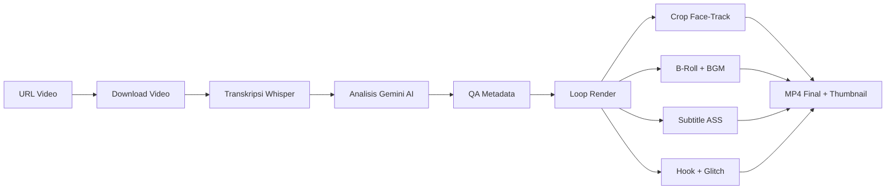

# 🎬 OpenSource Clipping

**Ultimate AI Auto-Clipper & Teaser Generator** — proyek open-source yang mengubah video panjang menjadi highlight pendek bergaya sinematik, lengkap dengan hook teaser, subtitle karaoke, dan thumbnail otomatis.

> 🇬🇧 [Read in English](README.md)

---

## ✨ Fitur Utama

| Fitur | Deskripsi |
|---|---|
| **AI Transcriber** | Transkripsi per-kata dengan akurasi tinggi menggunakan **Faster-Whisper** (large-v3) |
| **AI Content Curator** | **Google Gemini** menganalisis konteks, memilih momen paling viral, dan membuat metadata |
| **Smart Auto-Framing** | Pelacakan wajah via **[MediaPipe BlazeFace (Full-Range)](https://ai.google.dev/edge/mediapipe/solutions/vision/face_detector)** dengan algoritma Smooth Pan, Deadzone & anti-jitter |
| **Cinematic Teaser Hook** | Hook 3 detik dengan overlay gelap, cinematic bars, dan transisi **TV Glitch** |
| **Karaoke Subtitles** | Subtitle `.ASS` yang menyala per-kata (gaya Alex Hormozi / Veed) |
| **Kinetic Typography** | Penekanan kata otomatis dengan animasi bounce/stagger & sistem dual-font |
| **B-Roll Integration** | Mengambil stock footage kontekstual dari **Pexels** dengan crossfade & Ken Burns |
| **Auto-BGM & Ducking** | Musik latar otomatis dari Pixabay dengan sidechain ducking |
| **Auto-Thumbnail** | Ekstraksi frame dengan overlay gelap dan teks judul besar |
| **Metadata Lintas Platform** | Judul/deskripsi/tag YouTube + caption TikTok — semua dalam Bahasa Inggris |
| **Auto YouTube Uploader** | Upload klip highlight beserta metadata ke YouTube secara otomatis dengan penjadwalan (opsional) |
| **Podcast Split-Screen** | Diarization speaker otomatis via **Pyannote** dengan layout split-screen atas-bawah untuk podcast (9:16). Mendukung **3+ speaker lintas scene** dengan frozen frame fallback per-speaker |
| **Podcast Camera Switch** | Deteksi speaker aktif otomatis dengan switching yang scene-aware — crop full 9:16 fokus ke pembicara aktif; blurred pillarbox hanya saat speaker di scene yang sama bicara bersamaan (9:16) |

> 🎬 **BARU: Mode Story Clip (`--story-mode`)**  
> Perlu merakit cerita dari potongan adegan spesifik di berbagai sumber video (misalnya untuk *campaign* brand)? Gunakan fitur Story Clip multi-sumber!  
> 👉 **[Baca dokumentasi lengkap Story Clip di sini](docs/STORY_CLIP.md)**

## 📋 Prasyarat

- **Python** 3.10+
- **FFmpeg** terinstall dan tersedia di PATH
- **GPU CUDA** disarankan (untuk Whisper; bisa fallback ke CPU)
- **Google Gemini API Key** ([dapatkan di sini](https://aistudio.google.com/apikey))
- **Pexels API Key** (opsional, untuk B-roll — [dapatkan di sini](https://www.pexels.com/api/))
- **HuggingFace Token** (opsional, untuk split-screen / camera-switch — [dapatkan di sini](https://huggingface.co/settings/tokens), perlu accept [Pyannote model agreement](https://huggingface.co/pyannote/speaker-diarization-3.1))

## ☁️ Menjalankan di Google Colab (Direkomendasikan)

Jika Anda tidak memiliki GPU di laptop/PC, cara termudah untuk menjalankan pipeline ini adalah melalui **Google Colab**.
Buka notebook Google Colab baru, pastikan Runtime memakai **T4 GPU**, lalu jalankan cell berikut secara berurutan:

**Cell 1: Setup & Clone**
```python
!rm -rf ./* ./.*
!git clone https://github.com/your-username/opensource-clipping.git .
!pip install -r requirements.txt
```

**Cell 2: Setup API Keys**
```python
import os
from pathlib import Path
from google.colab import userdata

# Daftarkan GOOGLE_API_KEY di menu Secrets Colab (ikon kunci)
GOOGLE_API_KEY = userdata.get("GOOGLE_API_KEY")

env_text = f"GOOGLE_API_KEY={GOOGLE_API_KEY}\n"
Path(".env").write_text(env_text, encoding="utf-8")
```

**Cell 3: Eksekusi (Contoh termasuk fallback Kaggle untuk float32)**
```python
URL_YOUTUBE = "https://www.youtube.com/watch?v=Dc4_aBFAYWE&pp=0gcJCdkKAYcqIYzv"
JUMLAH_CLIP = 10
RASIO = "9:16"
FONT_STYLE = "DEFAULT"
GEMINI_MODEL = "gemini-3-flash-preview"
# Gunakan 'float32' untuk limitasi hardware Kaggle, atau 'float16' untuk standar Colab T4
WHISPER_COMPUTE_TYPE = "float32"

!python main.py \
  --url "{URL_YOUTUBE}" \
  --clips {JUMLAH_CLIP} \
  --ratio "{RASIO}" \
  --font-style "{FONT_STYLE}" \
  --hook-duration 3 \
  --words-per-sub 5 \
  --gemini-model "{GEMINI_MODEL}" \
  --whisper-compute-type "{WHISPER_COMPUTE_TYPE}" \
  --no-bgm
```

*(Catatan: Kami juga telah menyertakan file `notebooks/Lib_OpenSource_Clipping.ipynb` di repositori ini sebagai template praktis).*

---

## 🚀 Cara Cepat (Lokal)

```bash
# 1. Clone repo
git clone https://github.com/your-username/opensource-clipping.git
cd opensource-clipping

# 2. Install dependensi (pilih salah satu)
pip install -r requirements.txt          # pip / Colab
# uv sync                               # atau pakai uv (baca pyproject.toml)

# 3. Setup API key
cp .env.sample .env
# Edit file .env dan masukkan GOOGLE_API_KEY kamu

# 4. Jalankan (Wajib sertakan --url)
python main.py --url "https://youtube.com/watch?v=VIDEO_ID"
# 5. Contoh Eksekusi

# Mode Standar (Default untuk 5 klip)
python main.py --url "https://youtube.com/watch?v=VIDEO_ID" --clips 5 --ratio 16:9

# Prioritaskan kualitas source tertinggi yang tersedia (default)
python main.py --url "https://youtube.com/watch?v=VIDEO_ID" --source-height max

# Batasi kualitas source hingga 1440p (2K)
python main.py --url "https://youtube.com/watch?v=VIDEO_ID" --source-height 1440

# Tuning output lebih tajam (mode biasa maupun dynamic-split)
python main.py --url "https://youtube.com/watch?v=VIDEO_ID" \
  --source-height 2160 \
  --video-cq 19 \
  --video-crf 17 \
  --video-preset slow \
  --video-scale-algo lanczos

# Mode Advanced (YOLOv8 GPU Face Tracking & Font Khusus)
python main.py --url "https://youtube.com/watch?v=VIDEO_ID" \
  --clips 7 \
  --face-detector yolo \
  --yolo-size 8m \
  --font-style STORYTELLER

# Mode Podcast Split-Screen (2 speaker, 9:16)
python main.py --url "https://youtube.com/watch?v=PODCAST_ID" \
  --clips 3 \
  --ratio "9:16" \
  --split-screen

# Mode Podcast Camera Switch (auto-switch ke speaker aktif, blurred pillarbox saat overlap)
python main.py --url "https://youtube.com/watch?v=PODCAST_ID" \
  --clips 3 \
  --ratio "9:16" \
  --camera-switch \
  --switch-hold-duration 2.0

# Mode Multi-Speaker Podcast (3 speaker lintas 2 scene)
python main.py --url "https://youtube.com/watch?v=PODCAST_ID" \
  --clips 3 \
  --ratio "9:16" \
  --camera-switch \
  --diarization-speakers 3

# Custom Hook Manual (menggunakan klip .mp4 eksternal)
python main.py --url "URL_VIDEO" --hook-source "URL_DRIVE_ATAU_PATH" --hook-source-start 5.0 --hook-duration 4

# Rendering Ultra-HD 2K (Download 1440p dan render resolusi vertikal 1440p native dengan penajaman)
python main.py --url "URL_VIDEO" --source-height 1440 --render-height source --video-sharpen

# Menggunakan NVIDIA NIM (DeepSeek-V3) sebagai pengganti Gemini
python main.py --url "URL_VIDEO" --ai-provider nvidia --nvidia-model "deepseek-ai/deepseek-v3"

# Output kotak untuk Instagram Feed (1:1)
python main.py --url "URL_VIDEO" --ratio "1:1" --clips 5

# Output portrait Instagram/Facebook (4:5)
python main.py --url "URL_VIDEO" --ratio "4:5" --clips 5

# Output portrait klasik (3:4)
python main.py --url "URL_VIDEO" --ratio "3:4" --clips 5

# TikTok source
python main.py --url "https://www.tiktok.com/@username/video/1234567890" --source tiktok --clips 3

# Instagram source
python main.py --url "https://www.instagram.com/reel/123456789/" --source instagram --clips 3

# Google Drive source
python main.py --url "https://drive.google.com/file/d/1234567890/view" --source gdrive --clips 3
```

## ⚙️ Opsi CLI

```
python main.py --help
```

| Argumen | Default | Deskripsi |
|---|---|---|
| `--url`, `-u` | — | URL video yang akan diproses (Wajib) |
| `--source` | `youtube` | Sumber video. Pilihan: `youtube`, `tiktok`, `instagram`, `gdrive`. |
| `--clips`, `-n` | `7` | Jumlah klip highlight yang dihasilkan |
| `--ratio`, `-r` | `9:16` | Rasio aspek output (`9:16`, `16:9`, `1:1`, `3:4`, `4:5`) |
| `--source-height` | `max` | Batas tinggi resolusi source saat download (`max`, `1080`, `1440`, `2160`, dst.) |
| `--ai-provider` | `gemini` | Provider AI untuk analisis (`gemini` atau `nvidia`). |
| `--nvidia-model` | `deepseek...` | Nama model untuk NVIDIA NIM API (misal `deepseek-ai/deepseek-v3`). |
| `--render-height` | `1080` | Target tinggi output render (`1080`, `1440`, `2160`, `source`) |
| `--video-bitrate` | `auto` | Target bitrate video (misal 8M, 12M, auto). 'auto' menyesuaikan resolusi. |
| `--video-sharpen` | — | Aktifkan filter penajaman (sharpening) ringan untuk hasil lebih jernih. |
| `--video-cq` | `23` | Target kualitas CQ untuk NVENC (lebih kecil = lebih tajam). [Range: 15-20 (Sangat Tajam), 21-25 (Standar), 26-50 (Buram)] |
| `--video-crf` | `20` | Target kualitas CRF untuk libx264 (lebih kecil = lebih tajam). [Range: 15-20 (Sangat Tajam), 21-25 (Standar), 26-50 (Buram)] |
| `--video-preset` | `auto` | Override preset encoder (NVENC: `p1`-`p7`, x264: `ultrafast`-`veryslow`). Gunakan `auto` untuk default. |
| `--video-scale-algo` | `lanczos` | Algoritma resize render (`lanczos`: tajam, `bicubic`: seimbang, `area`/`bilinear`: cepat/buram) |
| `--words-per-sub` | `5` | Maks kata per grup subtitle karaoke |
| `--hook-duration` | `3` | Durasi hook teaser (detik) |
| `--font-style` | `HORMOZI` | Preset font (`DEFAULT`, `STORYTELLER`, `HORMOZI`, `CINEMATIC`) |
| `--no-broll` | — | Nonaktifkan footage B-roll |
| `--no-hook` | — | Nonaktifkan hook glitch teaser |
| `--hook-source` | `None` | URL Google Drive atau path lokal untuk file video custom hook tunggal (.mp4) |
| `--hook-source-start` | `0.0` | Waktu mulai (detik) di dalam video custom hook |
| `--no-bgm` | — | Nonaktifkan musik latar |
| `--no-subs` | — | Nonaktifkan semua rendering subtitle |
| `--no-karaoke` | — | Gunakan teks biasa tanpa highlight karaoke |
| `--advanced-text` | `False` | Aktifkan typografi kinetik (skala kata & animasi pop) |
| `--advanced-text-hook` | `False` | Aktifkan typografi kinetik khusus untuk hook teaser |
| `--use-dlp-subs` | — | Unduh dan gunakan subtitle bawaan YouTube untuk mempercepat proses (melewati Whisper) |
| `--face-detector` | `mediapipe` | Model AI untuk crop wajah (`mediapipe` atau `yolo`) |
| `--box-face-detection` | `False` | Tampilkan kotak kuning deteksi wajah (debug) |
| `--dev-mode` | `False` | **[Eksperimental]** Aktifkan visualisasi konteks 16:9 untuk proses tracking/stabilisasi 9:16 |
| `--dev-mode-with-output` | `False` | **[Eksperimental]** Menghasilkan video final dan video "Director's Console" secara bersamaan di file terpisah. |
| `--dev-mode-with-output-merge` | `False` | **[Eksperimental]** Menghasilkan satu video side-by-side (2648x1220) dengan bingkai kotak (boxed) dan legend (v0.9.3). |
| `--track-lines` | `False` | Tampilkan garis crosshair kuning dari kotak wajah ke batas window tracking |
| `--static-crop` | `False` | Nonaktifkan pelacakan wajah dan gunakan static center crop untuk format `1:1`, `3:4`, dan `4:5` |
| `--yolo-size` | `8m` | Parameter model YOLO ADetailer (`8n`, `8s`, `8m`, `8n_v2`, `9c`) |
| `--whisper-model` | `large-v3` | Ukuran model Whisper ([lihat daftar model](https://github.com/SYSTRAN/faster-whisper?tab=readme-ov-file#whisper)) |
| `--whisper-device` | `cuda` | Device Whisper (`cuda`, `cpu`, `auto`) |
| `--whisper-compute-type` | `float16` | Tipe komputasi Whisper (`float16`, `int8`, dll) |
| `--gemini-model` | `gemini-3-flash-preview` | Nama model Gemini |
| `--gemini-fallback-model` | `gemini-2.5-flash` | Nama model fallback Gemini jika model utama gagal |
| `--load-gemini-json` | `False` | Memuat file `gemini_response.json` dari folder output untuk melewati pemanggilan API Gemini AI (berguna untuk reproduksi/debug) |
| `--split-screen` | `False` | Aktifkan mode split-screen untuk podcast (hanya 9:16, butuh `HF_TOKEN`). Mendukung 3+ speaker lintas scene |
| `--diarization-speakers` | `auto` | Jumlah speaker untuk diarization (set ke `3` untuk fix 3 orang, atau `auto` untuk deteksi visual AI otomatis) |
| `--camera-switch` | `False` | Aktifkan mode camera-switch untuk podcast — crop full 9:16 berpindah ke speaker aktif; blurred pillarbox saat kedua speaker bicara bersamaan (hanya 9:16, butuh `HF_TOKEN`) |
| `--switch-hold-duration` | `2.0` | Durasi minimum (detik) sebelum berpindah speaker (hanya untuk camera-switch) |
| `--split-zoom` | `1.0` | Faktor zoom manual untuk panel split-screen (misal 1.2, 1.5) |
| `--split-v-align` | `0.5` | Perataan vertikal untuk panel split-screen (0.0=atas, 0.5=tengah, 1.0=bawah) |
| `--split-auto-zoom` | `False` | **[Baru]** Aktifkan zoom otomatis untuk memisahkan speaker agar frame tetap bersih dan fokus |
| `--split-max-zoom` | `2.5` | Batas zoom maksimal yang diperbolehkan untuk auto-zoom (default: 2.5) |
| `--track-step` | `None` | Frekuensi pengecekan wajah dalam detik (default: `0.25`) |
| `--track-deadzone` | `None` | Rasio area "aman" di mana kamera tidak bergerak (default: `0.15`) |
| `--track-smooth` | `None` | Faktor kecepatan kamera mengejar wajah (default: `0.30`) |
| `--track-jitter` | `None` | Ambang batas pixel untuk anti-getar (default: `5`) |
| `--track-snap` | `None` | Ambang batas lompatan wajah untuk hard cut (default: `0.25`) |
| `--track-conf` | `0.55` | **[Eksperimental]** Ambang batas keyakinan deteksi wajah (Naikkan untuk cegah hantu) |
| `--track-smooth-window` | `12` | **[Eksperimental]** Jumlah frame untuk stabilitas layout (12 frame ≈ 0.5 dtk) |
| `--scene-cut-threshold` | `18` | **[Eksperimental]** Sensitivitas deteksi cut kamera (Reset history instan) |
| `--track-iou-threshold` | `0.2` | **[Eksperimental]** Ambang batas penggabungan kotak wajah yang nempel |

## 📐 Rasio Aspek

OpenSource Clipping mendukung **5 rasio aspek output**. Semua rasio vertikal/kotak menyertakan **face-tracking** secara default untuk menjaga subjek tetap di tengah frame.

| Rasio | Resolusi Output | Face Tracking | Cocok Untuk |
|---|---|---|---|
| `9:16` | 1080×1920 | ✅ Ya | TikTok, Reels, YouTube Shorts |
| `16:9` | 1920×1080 | ❌ Tidak (letterbox jika source berbeda) | YouTube, Konten Landscape |
| `1:1` | 1080×1080 | ✅ Ya (bisa dinonaktifkan via `--static-crop`) | Instagram Feed, Twitter/X |
| `3:4` | 1080×1440 | ✅ Ya (bisa dinonaktifkan via `--static-crop`) | Instagram Portrait, Pinterest |
| `4:5` | 1080×1350 | ✅ Ya (bisa dinonaktifkan via `--static-crop`) | Instagram/Facebook Feed |

> [!NOTE]
> Jika menggunakan output `16:9` dengan source yang bukan 16:9 (misal video vertikal), sistem akan menerapkan **letterboxing** (bar hitam) untuk menjaga proporsi asli tanpa men-stretch gambar.

## 🎙️ Perbedaan Mode Podcast

Saat memproses video podcast, Anda dapat memilih antara beberapa mode rendering cerdas. Mode-mode ini mendukung **3+ speaker di berbagai scene**.

### 1. **`--split-screen` (Layout Terpisah)**
Membagi layar menjadi beberapa panel untuk menampilkan pembicara sekaligus.
*   **Default:** Layout **Top-Bottom** permanen (mendukung 3+ speaker via pergantian panel).
*   **`--dynamic-split`:** Otomatis berganti antara **Full 9:16** (saat 1 orang bicara/terlihat) dan **Split** (saat 2+ orang aktif).
*   **Mode Pemicu (`--split-trigger`):**
    *   **`diarization` (Default):** Menggunakan audio (siapa yang bicara). Butuh `HF_TOKEN`. Ada efek redup pada speaker pasif.
    *   **`face`:** Menggunakan deteksi wajah visual. **Tanpa token**. Tidak ada efek redup.
*   **Fitur Optimasi:**
    *   **Smart Separation Zoom (`--split-auto-zoom`):** Menyesuaikan tingkat zoom panel secara dinamis untuk menjaga komposisi tetap padat pada pembicara dan membuang wajah orang lain yang ikut terdeteksi di panel yang sama. Sangat efektif jika pembicara duduk berdekatan.
    *   **Vertical Tracking:** Secara otomatis mengikuti ketinggian wajah target sehingga pembicara selalu berada di tengah secara vertikal (bisa diatur manual via `--split-v-align`).
*   **Cocok Untuk:** Podcast edukasi atau saat reaksi lawan bicara sangat penting.

### 2. **`--camera-switch` (Switching Sinematik)**
Meniru gaya editing profesional dengan fokus penuh pada satu pembicara yang aktif.
*   **Tampilan:** **Full 9:16** yang berpindah-pindah.
*   **Scene-Aware:** Otomatis memakai **Blurred Pillarbox** jika dua orang di scene yang sama bicara bersamaan; tetap full crop jika dari scene berbeda.
*   **Cocok Untuk:** Storytelling, interview, atau klip dengan energi tinggi.

---

### **Tabel Perbandingan**

| Fitur | `--split-screen` | `--camera-switch` |
| :--- | :--- | :--- |
| **Layout Visual** | Split (Atas-Bawah) | Layar Penuh (Switching) |
| **Mode Dinamis** | ✅ `--dynamic-split` (Otomatis) | ✅ Selalu Dinamis |
| **Sumber Pemicu** | Audio atau Visual (`--split-trigger`) | Audio Saja (Diarization) |
| **Reaksi Lawan Bicara** | ✅ Keduanya terlihat | ❌ Hanya 1 yang terlihat |
| **Prasyarat** | Opsional `HF_TOKEN` (Mode visual tanpa token) | `HF_TOKEN` (Wajib) |

> [!TIP]
> Gunakan `--split-screen --dynamic-split --split-trigger face` untuk proses render tercepat tanpa perlu API token khusus atau model Diarization.

---

## 🚀 Contoh Eksekusi Cepat

```bash
# 1. Clipping AI Standar (7 klip, 9:16)
python main.py --url "URL_VIDEO"

# 2. Dynamic Split-Screen (Berbasis Visual, TANPA TOKEN)
python main.py --url "URL_VIDEO" --split-screen --dynamic-split --split-trigger face

# 3. Dynamic Split-Screen (Berbasis Audio, Sorot yang bicara, butuh HF_TOKEN)
python main.py --url "URL_VIDEO" --split-screen --dynamic-split --split-trigger diarization

# 4. Camera Switch Sinematik (Butuh HF_TOKEN)
python main.py --url "URL_VIDEO" --camera-switch

# 5. Smart Separation Split-Screen (Auto-Zoom & Vertical Tracking)
python main.py --url "URL_VIDEO" --split-screen --dynamic-split --split-trigger face --split-auto-zoom --split-v-align 0.4

# 6. Output kotak (1:1) dengan Split-Screen
python main.py --url "URL_VIDEO" --ratio "1:1" --split-screen --dynamic-split --split-trigger face
```

> [!IMPORTANT]
> Fitur diarization memerlukan persetujuan model Pyannote di HuggingFace dan token `HF_TOKEN` di file `.env`.

## 📂 Struktur Proyek

```
opensource-clipping/
├── main.py                  # Entry point CLI
├── run_upload.py            # CLI auto-uploader YouTube
├── pyproject.toml           # Dependensi & metadata proyek
├── .env.sample              # Template API key
├── .gitignore
├── README.md                # Dokumentasi (English)
├── README_ID.md             # Dokumentasi (Indonesia)
├── clipping/
│   ├── __init__.py
│   ├── config.py            # Konfigurasi master & argparse
│   ├── engine.py            # Download → Transkripsi → Gemini AI
│   ├── diarization.py       # Pyannote speaker diarization (split-screen & camera-switch)
│   ├── metadata.py          # Normalisasi & QA metadata
│   ├── studio.py            # Mesin render video (face-track, split-screen, camera-switch, subs, B-roll, BGM)
│   └── runner.py            # Orkestrator pipeline
└── youtube_uploader/
    ├── __init__.py
    └── uploader.py          # Logika upload & penjadwalan YouTube
```

## 🔄 Alur Pipeline



## 📤 Output

Untuk setiap klip, pipeline akan membuat folder `outputs/` dan menghasilkan:

| File | Deskripsi |
|---|---|
| `outputs/highlight_rank_N_ready.mp4` | Klip final dengan subtitle, B-roll, BGM |
| `outputs/thumbnail_rank_N.jpg` | Thumbnail otomatis dengan teks judul |
| `outputs/render_manifest.json` | Manifest berisi metadata semua klip |
| `outputs/metadata_preview.json` | Metadata dari Gemini (judul, tag, caption) |

## 🎵 Gaya Font

| Gaya | Font Utama | Font Penekanan | Cocok Untuk |
|---|---|---|---|
| `HORMOZI` | Montserrat | Anton | Bisnis / motivasi |
| `STORYTELLER` | Inter | Lora | Narasi / storytelling |
| `CINEMATIC` | Roboto | Bebas Neue | Film / dramatis |
| `DEFAULT` | Montserrat Black | Montserrat Medium | Serbaguna |

## 🎛️ Penjelasan Parameter Konfigurasi

**▶️ Pengaturan Utama**
- `--url` : Link video sumber
- `--source` : Sumber platform video (Pilihan: `youtube`, `tiktok`, `instagram`, `gdrive`). Default: `youtube`.
- `--clips` : Berapa banyak klip yang ingin dihasilkan
- `--ratio` : `9:16` untuk TikTok/Reels/Shorts, `16:9` untuk YouTube biasa, `1:1` untuk Instagram Feed, `3:4` untuk Pinterest, `4:5` untuk Instagram/Facebook Feed
- `--source-height` : Batas resolusi source saat download (`max` = ambil kualitas tertinggi yang tersedia)
- `--video-cq` : Nilai CQ untuk NVENC (default `23`). [15-20: Ultra HD, 21-25: Standar, 26-50: Buram/Kecil]
- `--video-crf` : Nilai CRF untuk libx264 (default `20`). [15-20: Ultra HD, 21-25: Standar, 26-50: Buram/Kecil]
- `--video-preset` : Override preset encoder. (Contoh: `slow`, `faster` untuk x264; `p7`, `p1` untuk NVENC)
- `--video-scale-algo` : Algoritma scaling render. Gunakan `lanczos` untuk hasil paling tajam.

**🎬 Pengaturan Konten & Hook**
- `--words-per-sub` : Jumlah maksimal kata yang muncul di layar (karaoke style)
- `--hook-duration` : Durasi teaser di awal video (detik)
- `--no-broll` : Matikan fitur B-roll (stock footage otomatis)
- `--no-hook` : Matikan hook glitch di awal klip

**🎨 Pengaturan Subtitle (ASS)**
- `--font-style` : Pilih gaya font untuk subtitle
- `--no-subs` : Matikan semua rendering subtitle (video bersih tanpa teks)
- `--no-karaoke` : Matikan efek warna kuning per-kata, ganti dengan teks bersih muncul satu per satu
- `--advanced-text` : Aktifkan efek scaling kata besar-kecil (kinetic typography)
- `--advanced-text-hook` : Aktifkan efek scaling kata khusus untuk teaser hook di awal video

**⚙️ Pengaturan Engine Pendukung**
- `--use-dlp-subs` : Aktifkan pengunduhan subtitle bawaan YouTube (jika tersedia) untuk bypass proses AI Whisper (sangat menghemat waktu komputasi).

**🎙️ Pengaturan Split-Screen (Podcast)**
- `--split-screen` : Aktifkan mode split-screen atas-bawah untuk video podcast. Mendukung **3+ speaker lintas scene**. Menggunakan **Pyannote** untuk mendeteksi siapa yang berbicara.
- `--dynamic-split` : Aktifkan mode dinamis yang otomatis berpindah antara full-screen (saat 1 orang bicara) dan split-screen (saat 2 orang bicara). Memerlukan flag `--split-screen`.
- `--split-trigger` : Pemicu splitting: `diarization` (berdasarkan suara, butuh `HF_TOKEN`) atau `face` (berdasarkan jumlah wajah yang terlihat, tanpa token).
- `--diarization-speakers` : Jumlah speaker yang diharapkan (default: `auto`). Mode `auto` akan melakukan visual scanning otomatis untuk menghitung jumlah wajah terbanyak di satu frame untuk mencegah *over-segmentation*. Memerlukan `HF_TOKEN` di file `.env`.

> ⚠️ **Catatan**: Untuk menggunakan split-screen, Anda perlu:
> 1. Mendaftarkan akun di [HuggingFace](https://huggingface.co/) dan membuat token
> 2. Accept [user agreement Pyannote](https://huggingface.co/pyannote/speaker-diarization-3.1)
> 3. Menambahkan `HF_TOKEN=your-token` di file `.env`

**📹 Pengaturan Camera Switch (Podcast)**
- `--camera-switch` : Aktifkan mode camera-switch penuh — video 9:16 bergantian mengikuti speaker yang aktif. **Scene-aware**: blurred pillarbox hanya muncul saat speaker di scene yang sama bicara bersamaan; jika speaker dari scene berbeda, tetap fokus ke speaker saat ini. **Mutually exclusive** dengan `--split-screen` (split-screen lebih prioritas jika keduanya diaktifkan).
- `--switch-hold-duration` : Durasi minimum (detik) sebelum sistem berpindah speaker (default: `2.0`). Berguna agar tidak flickering saat pergantian cepat.

**🔭 Pengaturan Tracking & Kamera (Auto-Framing)**
- `--track-step` : Frekuensi pengecekan wajah dalam detik (default: `0.25`). Makin kecil makin responsif tapi makin berat.
- `--track-deadzone` : Rasio area "aman" di tengah di mana kamera tidak akan bergerak (default: `0.15`).
- `--track-smooth` : Faktor kecepatan kamera mengejar wajah (default: `0.30`). Makin besar makin cepat menyusul.
- `--track-jitter` : Ambang batas pixel untuk mengabaikan getaran kecil (default: `5`).
- `--track-snap` : Ambang batas lompatan wajah untuk memicu hard cut antar pembicara (default: `0.25`).
- `--track-conf` : Ambang batas keyakinan (*confidence*) deteksi wajah (default: `0.55`). Naikkan jika banyak "deteksi hantu", turunkan jika wajah sering hilang.
- `--track-smooth-window` : Jumlah frame untuk stabilisasi layout (default: `12`). (12 frame ≈ 0.5 dtk, 24 frame ≈ 1 dtk pada 24fps). Makin besar makin stabil.
- `--scene-cut-threshold` : Sensitivitas deteksi perpindahan kamera (default: `18`). Mereset history layout secara instan saat kamera pindah. **[Range: 15-20 (Gelap/Studio), 30-45 (Terang)]**
- `--track-iou-threshold` : Ambang batas penggabungan kotak wajah (default: `0.2`). Semakin rendah semakin agresif dalam menggabungkan kotak deteksi yang nempel. **[Range: 0.1-0.5]**
- `--track-lines` : Tampilkan garis crosshair kuning untuk kalibrasi visual window 9:16.
- `--dev-mode` : **[Eksperimental]** Aktifkan mode visualisasi "Director" untuk rasio 9:16. Sangat berguna untuk kalibrasi responsivitas AI tracking.
- `--dev-mode-with-output` : Menghasilkan **dua** file `mp4` secara bersamaan: video 9:16 standar dan video 1920x1080 "Director's Console" (menghemat waktu proses AI).
- `--dev-mode-with-output-merge` : Menghasilkan output **side-by-side** (2648x1220) yang menggabungkan video akhir dan "Director's Console" dalam satu layar selebar ultrawide. Sangat cocok untuk verifikasi real-time!

> 💡 **Skenario rendering Camera Switch:**
> - **Satu speaker aktif** → crop full 9:16 mengikuti wajah speaker tersebut
> - **Beberapa speaker aktif, scene sama** → **blurred pillarbox** (frame 16:9 asli diletakkan di tengah, sisi diisi blur background)
> - **Beberapa speaker aktif, scene berbeda** → tetap fokus ke speaker saat ini (tanpa pillarbox)
> - **Tidak ada yang bicara** → tetap pada speaker terakhir yang aktif

**🌐 Asset Eksternal**
- Semua asset pendukung (Model AI, Glitch video, Font) akan diunduh **otomatis** saat pertama kali dijalankan

## 🐍 Rekomendasi Konfigurasi (Notebook/Colab)

Berikut adalah konfigurasi yang telah teruji untuk hasil optimal di berbagai skenario.

### 1. Mode Standar (Standard Clipping)
Cocok untuk video umum di mana Anda menginginkan akurasi dan fokus terbaik.
```python
# Konstanta untuk Clipping Standar
URL_YOUTUBE = "https://www.youtube.com/watch?v=UXhdIF8kvCI"
JUMLAH_CLIP = 7
RASIO = "9:16"
FONT_STYLE = "DEFAULT"
GEMINI_MODEL = "gemini-2.0-flash"

!python main.py \
  --url "{URL_YOUTUBE}" \
  --clips {JUMLAH_CLIP} \
  --ratio "{RASIO}" \
  --font-style "{FONT_STYLE}" \
  --hook-duration 3 \
  --words-per-sub 5 \
  --face-detector yolo \
  --gemini-model "{GEMINI_MODEL}" \
  --no-bgm \
  --no-subs \
  --no-broll \
  --use-dlp-subs
```

### 2. Mode Split-Screen (Podcast)
Dioptimalkan untuk podcast dengan 2+ speaker menggunakan deteksi YOLO yang stabil.
```python
# Konstanta untuk Split-Screen
URL_YOUTUBE = "https://www.youtube.com/watch?v=UXhdIF8kvCI"
JUMLAH_CLIP = 3
RASIO = "9:16"
FONT_STYLE = "DEFAULT"
GEMINI_MODEL = "gemini-2.0-flash"

!python main.py \
  --url "{URL_YOUTUBE}" \
  --clips {JUMLAH_CLIP} \
  --ratio "{RASIO}" \
  --font-style "{FONT_STYLE}" \
  --hook-duration 3 \
  --words-per-sub 5 \
  --gemini-model "{GEMINI_MODEL}" \
  --no-bgm \
  --no-subs \
  --no-broll \
  --split-screen \
  --dynamic-split \
  --split-trigger face \
  --face-detector yolo \
  --use-dlp-subs
```

## 📺 Upload Otomatis ke YouTube

Proyek ini sekarang menyertakan uploader YouTube mandiri (standalone) dengan dukungan penjadwalan (scheduling) otomatis!

1. Tempatkan file `youtube_token.json` Anda yang telah dikonfigurasi ke dalam folder `.credentials/` (buat foldernya secara manual jika belum ada).
2. Setelah proses render secara keseluruhan selesai, script secara otomatis akan membaca metadata dan file video dari dalam folder `outputs/` (contoh: `outputs/render_manifest.json`). Anda cukup jalankan script uploader:
   ```bash
   # Mode biasa (default interval 8 jam & scheduling otomatis)
   python run_upload.py

   # Atau jalankan dengan argumen kustom (contoh):
   python run_upload.py --interval-hours 12 --tz-name "Asia/Jakarta"
   ```
3. Untuk mengetes hanya dengan video pertama, jalankan dengan argumen `--test-mode`. Gunakan perintah `python run_upload.py --help` untuk melihat opsi timezone dan interval penjadwalan.

## 📄 Lisensi

Open source. Bebas digunakan, dimodifikasi, dan didistribusikan.
